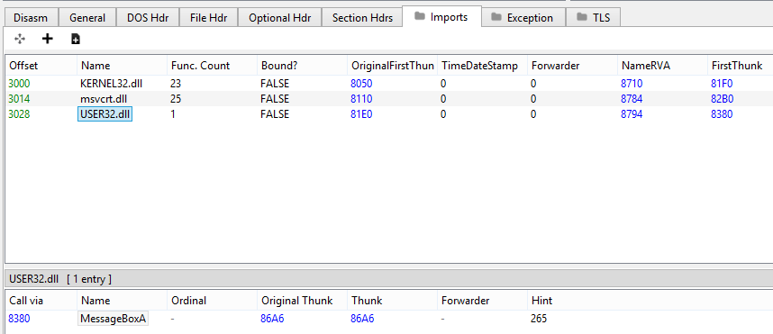
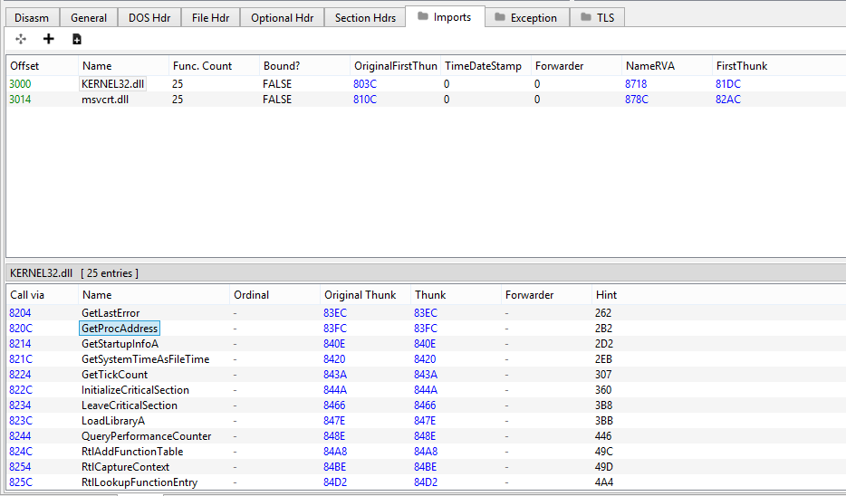

# Optimizing Windows Function Resolving: A Case Study Into GetProcAddress
#### Written by [hypervis0r](https://twitter.com/hypervis0r) and [Jeff](https://twitter.com/Jeffsepticeye2)

## Introduction
It was a cold winter morning. hypervis0r had just woken up at 1 AM because his sleep schedule was royally fucked, and he hopped onto the private phasetw0 discord server. In there, he noticed Jeff and base64 discussing the feasibility of running a binary search on the export data directory of a PE file in order to resolve functions.

hypervis0r, who is in love with hash tables, suggested an obvious solution for optimizing `GetProcAddress`; generating a hash table from a loaded DLL and using the hash table for constant-time lookup speeds. Base64, who feels the compulsive need to disagree with everything hypervis0r says, suggested that brute force lookup would probably be faster, and compelled him to run a benchmark. hypervis0r never turns down a challenge, so he decided to spend the next 8 hours of his life running tests.

Eight hours later, both hypervis0r and Jeff had programmed some basic implementations of `GetProcAddress` and battled them to the death with benchmarks. Spoiler alert, hypervis0r's implementation was the fastest (it always is), and he felt the need to compile this all into a blog post for the masses.

This article is not gonna cover anything in depth, since it was meant to just show the benchmarks of some methods Jeff and hypervis0r implemented. It's only going to briefly cover the concepts needed to understand the content of this article, along with providing links to some in-depth resources.

## How does GetProcAddress work?

For the uninitiated, all executable files on Windows contain an array of imported and exported functions stored inside the Portable Executable (PE) file format.

```cpp
#include <stdio.h>

int main(void)
{
	puts("ma name jeff");
	return 0;
}
```

If you are a C/C++ developer, you now that `puts` is not a function that you write yourself, but rather one you can magically call. This is possible through the use of [Dynamic-Link Libraries, or DLLs](https://en.wikipedia.org/wiki/Dynamic-link_library).

There are many DLLs, in this case `msvcrt.dll`, which have certain functions already compiled and exported (e.g. can be used by other programs). In this example, when your executable is loaded by Windows, the kernel will load `msvcrt.dll` into the address space of your new process, and the Import Address Table (IAT) of your executable will be updated with the virtual address of the exported function, in this case `puts`.

Take the following code, for instance.
```cpp
#include <windows.h>

int main(void)
{
	MessageBoxA(NULL, "calling MessageBoxA directly", "kek", MB_OK);
	return 0;
}
```

If you compile this code and open the executable in PE-bear (or any other PE file explorer), you will notice `MessageBoxA` among the imports of this program. If you were to open up the containing module in a PE file explorer, you would find `MessageBoxA` located in the list of exported functions.



This works because the Windows executable loader can read the IAT of the loaded executable, load `user32.dll` into the process address space, and update the virtual address for the import entry. When `MessageBoxA` gets called, the instruction pointer will get set to the updated virtual address in the IAT.

In addition to loadtime function resolving, functions can also be resolved dynamically during runtime. Take the following code, for example.

```cpp
#include <windows.h>

typedef int(WINAPI *_MessageBoxA)(HWND, LPCSTR, LPCSTR, UINT);

int main(void)
{
	HMODULE hUser32 = LoadLibrary("User32.dll");
	_MessageBoxA MyMessageBoxA = (_MessageBoxA)GetProcAddress(hUser32, "MessageBoxA");
	if (!MyMessageBoxA)
    {
		return -1;
	}

	MyMessageBoxA(NULL, "calling MessageBoxA undirectly", "kek", MB_OK);

	return 0;
}
```

This code does the exact same thing as the previous example. However, if you compile and examine the executable with a PE file explorer, you will find that there is no reference to `MessageBoxA` or `User32.dll` in the IAT.



This is standard behavior, as the program is not directly calling any functions from that DLL. As a result, there is no reason for it to be loaded by the Windows executable loader at loadtime. In this case, the program is manually loading `User32.dll` at runtime using `LoadLibrary`, finding the address of the function it needs using `GetProcAddress`, then calling it via a function pointer.

In essence, `GetProcAddress` walks through a table found in DLLs known as the export directory table to find the relative virtual address (RVA; relative to the DLL base address) of a function. This table contains the names and RVAs of every exported function in a PE file, and is used to resolve exported function locations easily. For more in-depth information, refer to [the MSDN page on the PE format](https://docs.microsoft.com/en-us/windows/win32/debug/pe-format#the-edata-section-image-only).

Using dynamic function resolution has the advantage of removing what functions you're intending to call from the IAT. For example, let's take a basic shellcode injection. The usual implementation of it follows the pattern `OpenProcess -> VirtualAllocEx -> WriteProcessMemory -> CreateRemoteThread -> WaitForSingleObject`, so whenever you see these functions in the IAT, you can be reasonably sure that there is some kind of injection happening. By dynamically resolving functions at runtime, you can remove those patterns from your executable import table.

There is one key thing to note however; if you take another look at the above picture, you'll find that the executable now has two additional imports from `kernel32.dll`, `LoadLibraryA` and `GetProcAddress`. You wouldn't know what functions are being called, however if you were experienced in reverse-engineering, you would know that dynamic function analysis is being used somehow. Knowing this, one could simply disassemble the function where `GetProcAddress` was called to find the resolved function.

For pretty obvious reasons, we didn't want `GetProcAddress` to appear in our imports, nor to get hooked somehow. The relatively simple solution was to make an implementation which manually parses the loaded DLLs to get the address of the function you want, without calling any external Windows API function. As it turns out, with a bit of knowledge about the [PE file format](https://blog.kowalczyk.info/articles/pefileformat.html) you can easily do it; however after reviewing several code repositories on GitHub, we noticed that a lot of them had a similar implementation, which is an (almost) identical inline assembly block (it's almost like they're are copy-pasting it or something!)

Simply rewriting `GetProcAddress` is no fun, we are computer scientists after all. To recount the introduction, hypervis0r and Jeff were curious to see if the `GetProcAddress` implementation could be potentially optimized for maximum speed and efficiency. As a result, we drew up a few different implementations and benchmarked each to determine if `GetProcAddress` could be faster in any such way.

To run our benchmarks, we decided to use Google's [`benchmark`](https://github.com/google/benchmark) library, written in C++. This library takes accurate measurements down to the nanosecond, and runs thousands of iterations to ensure a stable result. Along with `benchmark`, we decided to test against `ntdll.dll`, as it contains thousands of exports with different names.
```cpp
/*
	Exported function names located in different
	positions in the export directory.
*/
std::array<const char*, 21> func_names = {
   "A_SHAFinal",
   "CsrAllocateCaptureBuffer",
   "DbgBreakPoint",
   "EtwProcessPrivateLoggerRequest",
   "KiRaiseUserExceptionDispatcher",
   "LdrAccessResource",
   "MD4Final",
   "_wcsnset_s",
   "abs",
   "bsearch",
   "ceil",
   "fabs",
   "iswctype",
   "labs",
   "mbstowcs",
   "pow",
   "qsort",
   "sin",
   "tan",
   "vDbgPrintEx",
   "wcscat" };
```

## Case 1: Stock GetProcAddress
#### Written by hypervis0r

To start things off, we needed a control benchmark to determine whether a case performs better or worse. For this, we just run `GetProcAddress` with our list of functions from `ntdll.dll`. As expected, it performed moderately well in terms of the other techniques we tested. I suspect the reason why `GetProcAddress` is faster than most other custom implementations is due to the fact that there are some fancy tricks to optimize function resolving, such as [import hinting](https://devblogs.microsoft.com/oldnewthing/20100317-00/?p=14573) and [import binding](https://devblogs.microsoft.com/oldnewthing/20100318-00/?p=14563).

###### Update:
[Tom Wilson](https://twitter.com/uint_ptr) helpfully pointed out that the reason `GetProcAddress` is faster than most of these implementations is due to the fact that [`GetProcAddress` actually uses binary search internally](https://doxygen.reactos.org/d1/dda/ldrpe_8c.html#a4e9e9b9c629351c39174b18cd1225943). Always do your homework kids!

```cpp
/* 
    /favor:AMD64 /arch:AVX2
    Written by hypervis0r
*/
void BM_GetProcAddress(benchmark::State& state)
{
	HMODULE hNtdll = LoadLibraryA("ntdll.dll");

	FARPROC func = NULL;

	/*
    	Start the benchmark
    */
	for (auto _ : state)
	{
		for (int i = 0; i < func_names.size(); i++)
		{
			func = GetProcAddress(hNtdll, func_names[i]);
			if (!func)
			{
				printf("[-] Failed to find exported function\n");
				exit(-1);
			}
		}
	}
}
BENCHMARK(BM_GetProcAddress);
```
### Results
**Time Complexity**: O(n)

**Space Complexity**: O(1)

**Benchmark Results**: ~= 3519 ns

## Case 2: Custom Brute Force Hash Search
#### Written by hypervis0r

Next, we wanted to test and see how efficient a brute force search was in the context of API hashing. This function just iterates through each entry in the export directory, hashes the function name, and compares it to the input hash. This function turned out to be the slowest out of all the cases, most likely due to the fact that my `djb2` hash function was not as optimized as `strcmp`.

```cpp
/* 
    /favor:AMD64 /arch:AVX2
    Written by hypervis0r
*/
void* GetProcAddress_BruteHash(PVOID pModuleBase, uint64_t djb2_hash)
{
	// Get DOS header
	PIMAGE_DOS_HEADER pImageDosHeader = (PIMAGE_DOS_HEADER)pModuleBase;
	if (pImageDosHeader->e_magic != IMAGE_DOS_SIGNATURE)
		return NULL;

	// Get NT headers
	PIMAGE_NT_HEADERS pImageNtHeaders = (PIMAGE_NT_HEADERS)((PBYTE)pModuleBase + pImageDosHeader->e_lfanew);
	if (pImageNtHeaders->Signature != IMAGE_NT_SIGNATURE)
		return NULL;

	// Get the EAT
	PIMAGE_EXPORT_DIRECTORY pImageExportDirectory = (PIMAGE_EXPORT_DIRECTORY)((PBYTE)pModuleBase + pImageNtHeaders->OptionalHeader.DataDirectory[0].VirtualAddress);

	PDWORD pdwAddressOfFunctions = (PDWORD)((PBYTE)pModuleBase + pImageExportDirectory->AddressOfFunctions);
	PDWORD pdwAddressOfNames = (PDWORD)((PBYTE)pModuleBase + pImageExportDirectory->AddressOfNames);
	PWORD pwAddressOfNameOrdinales = (PWORD)((PBYTE)pModuleBase + pImageExportDirectory->AddressOfNameOrdinals);

	for (WORD cx = 0; cx < pImageExportDirectory->NumberOfNames; cx++) {
		PCHAR pczFunctionName = (PCHAR)((PBYTE)pModuleBase + pdwAddressOfNames[cx]);
		PVOID pFunctionAddress = (PBYTE)pModuleBase + pdwAddressOfFunctions[pwAddressOfNameOrdinales[cx]];

		if (hash_string_djb2(pczFunctionName) == djb2_hash)
			return pFunctionAddress;
	}

	return NULL;
}

void BM_Brute(benchmark::State& state)
{
	HMODULE hNtdll = LoadLibraryA("ntdll.dll");

	void* func = NULL;

	for (auto _ : state)
	{
		for (int i = 0; i < djb2_list.size(); i++)
		{
			func = GetProcAddress_BruteHash(hNtdll, djb2_list[i]);
			if (!func)
			{
				printf("[-] Failed to find exported function\n");
				exit(-1);
			}
		}
	}
}
BENCHMARK(BM_Brute);
```

### Results
**Time Complexity**: O(n)

**Space Complexity**: O(1)

**Benchmark Results**:  ~= 989553 ns (247x slower than `GetProcAddress`)

## Case 3: Runtime-Generated Hash Table
#### Written by hypervis0r

For this test, I considered the possibility of generating a hash table containing all of the exported entries. At the time of writing this function, I was certain this function would be the fastest, as theoretically the time complexity was O(1) at its best. Base64 seemed to disagree with me, so to prove him wrong, I wrote up a hash table implementation with linked list chaining.

To my surprise, generating a hash table at runtime was *slower* than stock `GetProcAddress`. In shock, I ran the Visual Studio profiler to determine the cause of such speed loss. Of course, I had forgotten how slow the heap was, and most of the execution time of the program was spent inside of `malloc` and `free`.

Running the benchmarks, without including the hash table generation or freeing, showed that the hash table lookup was around 5x faster than `GetProcAddress`. With this knowledge, I was inspired to pre-generate the hash table and to embed it directly into the PE file, which will be elaborated on in Case 6.

```cpp
/* 
    /favor:AMD64 /arch:AVX2
    Written by hypervis0r
*/
struct hash_table_const* GenerateHashTableFromExports(PVOID pModuleBase)
{
	// Get DOS header
	PIMAGE_DOS_HEADER pImageDosHeader = (PIMAGE_DOS_HEADER)pModuleBase;
	if (pImageDosHeader->e_magic != IMAGE_DOS_SIGNATURE)
		return NULL;

	// Get NT headers
	PIMAGE_NT_HEADERS pImageNtHeaders = (PIMAGE_NT_HEADERS)((PBYTE)pModuleBase + pImageDosHeader->e_lfanew);
	if (pImageNtHeaders->Signature != IMAGE_NT_SIGNATURE)
		return NULL;

	// Get the EAT
	PIMAGE_EXPORT_DIRECTORY pImageExportDirectory = (PIMAGE_EXPORT_DIRECTORY)((PBYTE)pModuleBase + pImageNtHeaders->OptionalHeader.DataDirectory[0].VirtualAddress);

	PDWORD pdwAddressOfFunctions = (PDWORD)((PBYTE)pModuleBase + pImageExportDirectory->AddressOfFunctions);
	PDWORD pdwAddressOfNames = (PDWORD)((PBYTE)pModuleBase + pImageExportDirectory->AddressOfNames);
	PWORD pwAddressOfNameOrdinales = (PWORD)((PBYTE)pModuleBase + pImageExportDirectory->AddressOfNameOrdinals);

	/*
    	struct hash_table_const is an optimized hash table implementation
        that uses a single contiguous block of memory for all of the items.
    */
	struct hash_table_const* table = create_hash_table_const(pImageExportDirectory->NumberOfNames);

	for (WORD cx = 0; cx < pImageExportDirectory->NumberOfNames; cx++) {
		PCHAR pczFunctionName = (PCHAR)((PBYTE)pModuleBase + pdwAddressOfNames[cx]);
		PVOID pFunctionAddress = (PBYTE)pModuleBase + pdwAddressOfFunctions[pwAddressOfNameOrdinales[cx]];

		struct hash_table_item* item = create_hash_const_item(table, hash_string_djb2(pczFunctionName), pFunctionAddress);

		hash_table_insert(table, item);
	}

	return table;
}

void BM_GenHashTable(benchmark::State& state)
{
	HMODULE hNtdll = LoadLibraryA("ntdll.dll");

	void* func = NULL;

	for (auto _ : state)
	{
		struct hash_table_const* table = GenerateHashTableFromExports(hNtdll);

		for (int i = 0; i < func_names.size(); i++)
		{
			func = hash_table_search((struct hash_table*)table, hash_string_djb2(func_names[i]));
			if (!func)
			{
				printf("[-] FUCK");
				exit(-1);
			}
		}

		free_hash_table_const(table);
	}
}
BENCHMARK(BM_GenHashTable);
```

### Results
**Time Complexity**: O(1) on average; O(n) worst case

**Space Complexity**: O(n)

**Benchmark Results**: ~= 90039 ns (22x slower than `GetProcAddress`)

## Case 4: Runtime-Generated `std::unordered_map`
#### Written by hypervis0r

Base64, who is in love with all things C++, wanted to see if `std::unordered_map` was faster than my shitty hash table implementation, so I gave him the benefit of the doubt and tested it. While `std::unordered_map` was faster than the brute force hash search, it was still slower than my hash table implementation, because the STL is shit.

```cpp
/* 
    /favor:AMD64 /arch:AVX2
    Written by hypervis0r
*/
std::unordered_map <uint64_t, void*> GetUnorderedMapFromExports(PVOID pModuleBase)
{
	std::unordered_map <uint64_t, void*> map = {};

	// Get DOS header
	PIMAGE_DOS_HEADER pImageDosHeader = (PIMAGE_DOS_HEADER)pModuleBase;
	if (pImageDosHeader->e_magic != IMAGE_DOS_SIGNATURE)
		return map;

	// Get NT headers
	PIMAGE_NT_HEADERS pImageNtHeaders = (PIMAGE_NT_HEADERS)((PBYTE)pModuleBase + pImageDosHeader->e_lfanew);
	if (pImageNtHeaders->Signature != IMAGE_NT_SIGNATURE)
		return map;

	// Get the EAT
	PIMAGE_EXPORT_DIRECTORY pImageExportDirectory = (PIMAGE_EXPORT_DIRECTORY)((PBYTE)pModuleBase + pImageNtHeaders->OptionalHeader.DataDirectory[0].VirtualAddress);

	PDWORD pdwAddressOfFunctions = (PDWORD)((PBYTE)pModuleBase + pImageExportDirectory->AddressOfFunctions);
	PDWORD pdwAddressOfNames = (PDWORD)((PBYTE)pModuleBase + pImageExportDirectory->AddressOfNames);
	PWORD pwAddressOfNameOrdinales = (PWORD)((PBYTE)pModuleBase + pImageExportDirectory->AddressOfNameOrdinals);

    // Reserve space in the unordered map
	map.reserve(pImageExportDirectory->NumberOfNames);

	for (WORD cx = 0; cx < pImageExportDirectory->NumberOfNames; cx++) {
		PCHAR pczFunctionName = (PCHAR)((PBYTE)pModuleBase + pdwAddressOfNames[cx]);
		PVOID pFunctionAddress = (PBYTE)pModuleBase + pdwAddressOfFunctions[pwAddressOfNameOrdinales[cx]];

		map.emplace(hash_string_djb2(pczFunctionName), pFunctionAddress);
	}

	return map;
}

void BM_UnorderedMap(benchmark::State& state)
{
	HMODULE hNtdll = LoadLibraryA("ntdll.dll");

	void* func = NULL;

	for (auto _ : state)
	{
		auto map = GetUnorderedMapFromExports(hNtdll);

		for (int i = 0; i < func_names.size(); i++)
		{
			try
			{
				func = map.at(hash_string_djb2(func_names[i]));
			}
			catch (const std::exception& e)
			{
				printf("[-] Failed to find exported function\n %s\n", e.what());
				exit(-1);
			}
		}
	}
}
BENCHMARK(BM_UnorderedMap);
```

### Results
**Time Complexity**: O(1) on average; O(n) worst case

**Space Complexity**: O(n)

**Benchmark Results**: ~= 354985 ns (88x slower than `GetProcAddress`)

## Case 5: Binary Search
#### Written by Jeff

My goal was to make a somehow unique implementation, no matter how much it sucked. As a result, I started experimenting with linear search, that is, going through every export and comparing its name with the function I'm looking for. This was a lot slower than the original function, as it has the time complexity of O(n) at worst, where `n` is the total number of exported functions in a PE file. 

Later on, I noticed that the exports in some DLLs are alphabetically sorted, which led me to think of [binary searching](https://www.youtube.co/watch?v=P3YID7liBug) the array of exported functions. The beauty and elegance of binary search is that you only need to go through O(log n) exported entries at worst. Since `ntdll.dll` has 1910 functions that are exported by name (at the time of writing), I only needed 11 iterations at worst case. That, compared to linear search, is really fucking fast.

This implementation has a drawback, however. The exported functions located in the export directory need to be sorted in alphabetical order for binary search to function properly. While [the MSDN page for the PE format](https://docs.microsoft.com/en-us/windows/win32/debug/pe-format#the-edata-section-image-only) states that this is intentional, this is not guaranteed. A simple [`.def` file](https://docs.microsoft.com/en-us/cpp/build/reference/module-definition-dot-def-files?view=msvc-170) during compilation of a DLL can cause the exported functions to become unsorted, and thus, any such DLL would have to resort to using a brute force search.

```cpp
/* 
    /favor:AMD64 /arch:AVX2
    Written by Jeff
*/
PVOID GetProcAddress_BinarySearch(PVOID base, const char* func) {
	PIMAGE_DOS_HEADER dos = (PIMAGE_DOS_HEADER)base;
	PIMAGE_FILE_HEADER head = (PIMAGE_FILE_HEADER)((char*)base + dos->e_lfanew + sizeof(DWORD));
	PIMAGE_OPTIONAL_HEADER opt_head = (PIMAGE_OPTIONAL_HEADER)(head + 1);
	ULONG export_size = opt_head->DataDirectory[IMAGE_DIRECTORY_ENTRY_EXPORT].Size;
	ULONG export_rva = opt_head->DataDirectory[IMAGE_DIRECTORY_ENTRY_EXPORT].VirtualAddress;

	if (!export_size)
		return NULL;

	PIMAGE_EXPORT_DIRECTORY exports = (PIMAGE_EXPORT_DIRECTORY)((char*)base + export_rva);

	DWORD* name_rva = (PDWORD)((char*)base + exports->AddressOfNames);

	DWORD* function_rva = (PDWORD)((char*)base + exports->AddressOfFunctions);

	WORD* ordinal = (PWORD)((char*)base + exports->AddressOfNameOrdinals);


	// binary search

	unsigned long right, left, middle;
	right = exports->NumberOfNames;
	left = 0;

	while (right != left) {
		middle = left + ((right - left) >> 1);

		int result = strcmp((char*)base + name_rva[middle], func);
		if (!result)
			return (PVOID)((char*)base + function_rva[ordinal[middle]]);
		else if (result < 0) {
			left = middle;
		}
		else {
			right = middle;
		}
	}

	return NULL;
}

void BM_BinarySearch(benchmark::State& state)
{
	HMODULE hNtdll = LoadLibraryA("ntdll.dll");

	PVOID func = NULL;

	for (auto _ : state)
	{
		for (int i = 0; i < func_names.size(); i++)
		{
			func = GetProcAddress_BinarySearch(hNtdll, func_names[i]);
			if (!func)
			{
				printf("[-] Failed to find exported function\n");
				exit(-1);
			}
		}
	}
}
BENCHMARK(BM_BinarySearch);
```

### Results
**Time Complexity**: O(log n)

**Space Complexity**: O(1)

**Benchmark Results**: ~= 1348 ns (3x faster than `GetProcAddress`)

## Case 6: Linker-Generated Hash Table
#### Written by hypervis0r

Finally, after spending a week writing the implementation, I finally wrote the fastest implementation of `GetProcAddress`. The main performance issue with generating a hash table at runtime is the memory allocation and hashing. I had a brain blast and realized that if the hash table was included in the PE file itself, I could skip the generation and just directly access the table from the loaded module.

The benchmark tests showed that by utilizing the pre-generated hash table, lookup speeds took an astonishing 400 ns, 11 times faster than stock `GetProcAddress`. To accomplish this feat, I wrote a Python script utilizing the [`LIEF`](https://github.com/lief-project/LIEF) library to add a new section to a PE file containing the generated hash table.

Due to the fact that I was writing the hash table to disk in the PE section, I knew that I couldn't use regular linked list chaining to handle collisions. I first experimented with open addressing, which means whenever there's a hash collision, the new item is simply placed in the next free index. The results turned out to be relatively slow, due to the fact that the search algorithm would have to search through thousands of exports whenever there was a collision. I knew I had to use chaining somehow, and while researching I came across an algorithm used in information theory known as "Suffix Automaton". In short, it is a data structure used to access substrings of a string. It works using nodes that all point to each other and related substrings. Of course, I'm not working with strings, but rather chained nodes in a hash table, but the theory still applies. 


Whenever there is a hash collision, I simply find the next free index, and save the index in the colliding node, similar to chaining linked lists. These indices form a chain in the same manner as linked lists, however instead of saving addresses to the next node, I save indices. This is great because now we have the benefits of linked list chaining, and we are able to effectively serialize the hash table onto disk. Instead of having to search through thousands of exports with open addressing, we can simply search through 4 colliding nodes in the event of a collision.

Later on, after I had written the implementation for this case, I discovered that [\*nix systems have been doing this for years](https://blogs.oracle.com/solaris/post/gnu-hash-elf-sections). The `GNU_HASH` section was implemented in 2006 in order to better optimize function resolution using pre-compiled hash tables. The implementation of `GNU_HASH` even utilizes the DJB2 hash algorithm as well. Why Microsoft hasn't decided to implement something similar is quite surprising to me, seeing as there are very large performance gains. Embedding a pre-compiled hash table would even be backwards-compatible with older software, so I fail to see the reason for not utilizing hash tables for exports.

The Python script to generate the hash table can be found [in the GitHub repository](https://github.com/ph4s3tw0/GetProcAddressCaseStudies).

```cpp
/* 
    /favor:AMD64 /arch:AVX2
    Written by hypervis0r
*/
void* GetProcAddress_PreGenHashTable(PVOID pModuleBase, const char* key)
{
	// Get DOS header
	PIMAGE_DOS_HEADER pImageDosHeader = (PIMAGE_DOS_HEADER)pModuleBase;
	if (pImageDosHeader->e_magic != IMAGE_DOS_SIGNATURE)
		return;

	// Get NT headers
	PIMAGE_NT_HEADERS pImageNtHeaders = (PIMAGE_NT_HEADERS)((PBYTE)pModuleBase + pImageDosHeader->e_lfanew);
	if (pImageNtHeaders->Signature != IMAGE_NT_SIGNATURE)
		return;

	/* 
        Get the hash table section
        We just strap the section RVA onto the Architecture data directory
    */
	struct IMAGE_EXPORT_HASH_TABLE_DIRECTORY* pExportHashTable = VA(pModuleBase, pImageNtHeaders->OptionalHeader.DataDirectory[IMAGE_DIRECTORY_ENTRY_ARCHITECTURE].VirtualAddress);
	DWORD hash_table_size = pImageNtHeaders->OptionalHeader.DataDirectory[IMAGE_DIRECTORY_ENTRY_ARCHITECTURE].Size;

    // Get the total number of hash table entries
	DWORD total_entries = hash_table_size / sizeof(struct IMAGE_EXPORT_HASH_TABLE_DIRECTORY);
	struct IMAGE_EXPORT_HASH_TABLE_DIRECTORY* entry = NULL;

    // Get the table index
	uint64_t hash = hash_string_djb2(key);
	DWORD index = hash % total_entries;

    // Retrieve the index entry
	entry = &pExportHashTable[index];

	if (entry->key == hash) // We got a match
		return VA(pModuleBase, entry->address);
    else                    // Uh oh, hash collision
	{
		while (entry->next_index != -1)
		{
			/*
				This is the dirtiest C code I've ever written in my life.
				This bit of code right here is why rust is becoming more popular
			*/
			entry = &pExportHashTable[entry->next_index % total_entries];
			if (entry->key == hash)
				return VA(pModuleBase, entry->address);
		}
	}

	return NULL;
}

void BM_PreGenHashTable(benchmark::State& state)
{
	HMODULE hNtdll = LoadLibraryA("ntdll_pregen.dll");

	void* func = NULL;

	for (auto _ : state)
	{
		for (int i = 0; i < func_names.size(); i++)
		{
			func = GetProcAddress_PreGenHashTable(hNtdll, func_names[i]);
			if (!func)
			{
				printf("[-] Failed to find exported function\n");
				exit(-1);
			}
		}
	}
}
BENCHMARK(BM_PreGenHashTable);
```

### Results
**Time Complexity**: O(1) on average; O(n) worst case

**Space Complexity**: O(n)

**Benchmark Results**: ~= 383 ns (11x faster than `GetProcAddress`)

## Conclusion

Clearly there are some better methods to resolve functions rather than exclusively using `GetProcAddress`. We are certain that further experimentation can be done to further optimize function resolving, and we leave that as an exercise to the reader. If someone from the Microsoft Windows development team is reading this, hypervis0r is open for hire, so [hit him up](mailto://hypervis0r@phasetw0.com).

All code can be found on the [phasetw0 GitHub repository here](https://github.com/ph4s3tw0/GetProcAddressCaseStudies).

## References

[GitHub Repository](https://github.com/ph4s3tw0/GetProcAddressCaseStudies)

[MSDN PE Format](https://docs.microsoft.com/en-us/windows/win32/debug/pe-format)

[PE File Format; Kowalczyk](https://blog.kowalczyk.info/articles/pefileformat.html)

[Google Benchmark Library](https://github.com/google/benchmark)

[LIEF Library](https://github.com/lief-project/LIEF)
